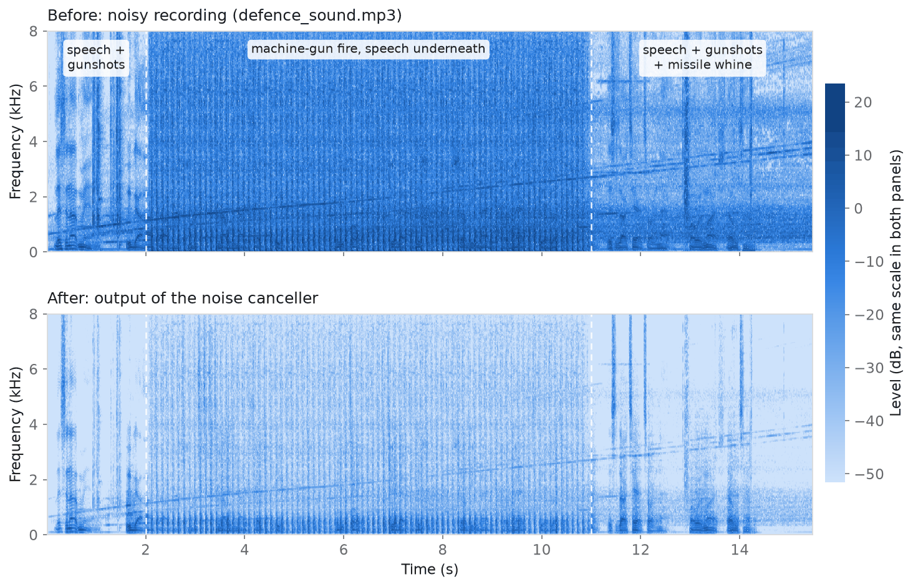
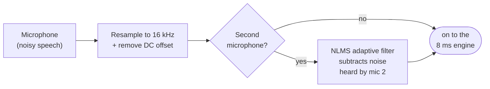
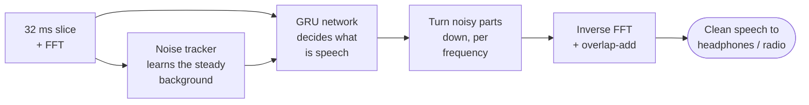

Hearing Voices Through Gunfire
AI-assisted adaptive noise cancellation for defence communication
Smart India Hackathon 2026 · Problem Statement 26052 · DRDO / Department of Defence Production
Imagine a soldier on the radio while a machine gun fires a few metres away,
a helicopter hovers overhead and a vehicle engine rumbles in the background.
The person on the other end should hear the voice, not the battlefield.
This project is our attempt at that. It is a noise canceller written in
MATLAB that:
is built to turn down three kinds of noise:
steady noise (engine hum, rotor drone, wind),
changing noise (missile / turbine whine, helicopters, sirens),
sudden, impulsive noise (gunshots, machine-gun bursts, explosions);
keeps the speech as intact as it can,
works in real time: it processes audio in 8 ms slices with only 32 ms
of delay, which is fast enough for a live radio link or a headset,
uses no MATLAB toolboxes, and the same algorithm also runs on an
NVIDIA Jetson.

How to read the picture: time runs left to right, pitch from bottom to top,
and darker blue means louder. In the top panel the machine-gun fire (2–11 s)
paints the whole picture blue: the noise is everywhere and at every pitch. In
the bottom panel, after our filter, most of that noise is gone and the dark
strokes that remain at the bottom are mostly speech. It is not perfect: some
machine-gun pulses and the rising missile whine are still faintly visible.
We say more about that under Results.
Listen for yourself: compare `audio/noisy/defence_sound.mp3`
with `results/defence_sound_enhanced.wav`
(and `defence_soundMG1.mpeg` with
`defence_soundMG1_enhanced.wav`).
---
Table of contents
Run it in two minutes
The big picture
What happens to your audio, step by step
How we built it (the whole process)
Measuring quality: SNR, STOI and PESQ in plain words
Results (the honest version)
Running it on an NVIDIA Jetson
Training your own model / making it better
What is in this repository
Little glossary
Credits, licences and references
---
1. Run it in two minutes
You need MATLAB R2016b or newer. No toolboxes are required; GNU Octave 8
works too.
Download this repository (green Code button → Download ZIP) and unzip it.
In MATLAB, open the unzipped folder.
Type `main_defence_anc` and press Enter.
You can run `defence_anc_all_in_one` instead: it is the same program in a
single file. Keep the `models/` and `audio/` folders next to it.
The program will then:
clean the two sample recordings in `audio/noisy/` and save them in `results/`,
play each one, first the original and then the cleaned version,
draw a before/after spectrogram for each,
print an estimate of how much the noise went down,
run a proper test with SNR, STOI and PESQ and print a results table.
A shortened example of what the command window shows:
```
 defence_sound.mp3  (15.5 s, single-mic, 44100 Hz)
 latency 32 ms | real-time factor 0.197 | saved: results/defence_sound_enhanced.wav
 Estimated SNR (no clean reference): input    7.6 dB  ->  output   20.5 dB
 Background noise reduction in speech pauses: 28.2 dB

######## Objective evaluation (clean speech + defence noise) ########
noise        SNRin | SNR (dB) noisy->enh | STOI noisy->enh | PESQ-WB noisy->enh | ...
gunshot         +5 |     5.00 ->  8.81   |  0.856 -> 0.894 |    1.26 ->  1.54   | ...
```
Cleaning your own recording
```matlab
addpath(genpath('src'));
[x, fs] = read_audio('my_recording.mp3');    % wav, mp3, mpeg, flac, ...
p = anc_params();                            % all settings live here
p.model = dnn_load();                        % load the trained AI model
[y, fs_out] = defence_anc(x, fs, p);         % y = cleaned speech at 16 kHz
sound(y, fs_out);                            % listen
audiowrite('my_recording_clean.wav', y, fs_out);
```
If you made the noisy file yourself by mixing clean speech with noise, put
the path of the clean speech in `clean_reference` at the top of
`main_defence_anc.m`. The program then reports the exact SNR, STOI and PESQ of
your file.
---
2. The big picture
Stage 1: preparing the input

Stage 2: the real-time engine, which runs every 8 ms

We combine two worlds:
Classic signal processing, which is fast, predictable and very good at
steady noise and at the microphone and sound-card side of things.
A small neural network, which is good at recognising patterns. The
thing that makes gunfire so hard is that it looks like speech to simple
filters: it's loud, sudden, and full of energy at speech frequencies. A
network trained on thousands of examples learns to tell the two apart.
---
3. What happens to your audio, step by step
Here is the journey of the sound through `defence_anc.m`, and every 8 ms
through `anc_process_frame.m`.
Step 1: Tidy up the input
The recording is converted to a standard format: one channel, 16,000
samples per second (plenty for speech), and with any DC offset removed.
Our own resampler (`resample_k.m`) is used, so no toolbox is needed.
Two microphones? If the file has two genuinely different channels (a main
mic near the mouth and a "reference" mic that mostly hears noise), we first
run an NLMS adaptive filter (`nlms_anc.m`). It learns how the noise travels
from the reference mic to the main mic and subtracts it. It pauses learning
while someone speaks, so it does not learn to cancel the voice. This is the
classic Widrow "adaptive noise cancelling" idea. The sample recordings are
mono, so this step is skipped for them.
Step 2: Cut the sound into overlapping slices
Every 8 ms we take the latest 32 ms of audio (512 samples), soften its
edges with a window, and use an FFT to see how much energy there is at each of
257 frequencies. Each slice overlaps the previous one, so nothing is lost.
Step 3: Learn what the steady background sounds like
A noise tracker (SPP-MMSE, from Gerkmann & Hendriks, 2012) looks at every
frequency and asks: is there probably speech here right now? When the answer
is "probably not", it updates its picture of the background noise. After a
fraction of a second it has learned the engine hum or rotor drone. It adapts
continuously, so it keeps up when the noise changes.
Step 4: Let the neural network decide what is speech
This is the AI part (`dnn_mask_step.m`). For each slice, the network receives:
the energy at each frequency of the noisy sound (257 numbers), and
the noise tracker's estimate of the background (257 numbers).
It passes them through three layers:
a dense layer of 192 neurons that summarises the slice;
a GRU layer with 256 units of memory: it remembers the recent past,
so it "knows" that a machine gun has been firing for the last few seconds
and a sudden bang is probably another shot, not a word;
an output layer that gives one number between 0 and 1 for every
frequency: the mask. 1 means "this is speech, keep it", 0 means "this
is noise, remove it".
The whole network has about 0.5 million weights and is tiny by modern
standards, so it runs comfortably in real time.
Step 5: Turn the noise down and rebuild the sound
Each frequency is multiplied by its mask value. The mask never goes below
−30 dB, so the result never sounds unnaturally "dead". We also cut everything
below 70 Hz (rumble and wind). An inverse FFT turns the slice back into sound,
and neighbouring slices are overlap-added into a smooth, continuous signal.
Step 6: Out it goes
Every 8 ms, 128 new clean samples leave the filter. The total built-in delay
is 32 ms, well below what people notice in a conversation.
> **No model file?** If `models/defence_gru.mat` is missing, steps 4–5 fall
> back to a purely classical method. It uses a gunshot detector, a whine
> tracker and the OM-LSA gain (Cohen 2001, Ephraim & Malah 1985), so the code
> always runs.
---
4. How we built it (the whole process)
We'd like to show how we got here, including the parts that did not work,
because that is where most of the learning happened.
4.1 Listening to the problem first
Before writing any filter we studied the two sample recordings:
Both are MP3s at 44.1 kHz. They are stereo, but both channels are identical,
so there is no second microphone to exploit.
From about 2 s to 11 s there is continuous machine-gun fire at about
9–10 rounds per second. Each "shot" is actually a 50–90 ms burst of noise,
and there is loud reverberant noise between the shots.
There are single gunshots, a rising whine (a missile or turbine
whose pitch climbs steadily), a steady 100 Hz engine hum and low
rumble.
Interestingly, both files contain the same background noise track,
aligned to the sample, with different speech on top.
These measurements became the recipe for our synthetic noise generator.
4.2 Building a fair test
The metrics we are judged on (SNR, STOI, PESQ) need the clean speech to
compare against, and a real battlefield recording does not have one. So we
built the test the way the problem statement describes:
take clean speech (CMU ARCTIC recordings, `audio/clean/`),
add defence noise at a known loudness (SNR),
clean it with our filter, and compare with the original clean speech.
To get enough varied noise we wrote `defence_noise.m`, a generator for
gunshots, machine-gun bursts, artillery, helicopters, missile whine, drones,
sirens, armoured vehicles, hum and wind. We calibrated it against the real
recordings (burst length, firing rate, spectrum). We also kept aside some
real recordings from the public ESC-50 dataset (helicopter, siren, engine,
fireworks and more), which were never used for training. They act as a
reality check that the filter is not only good at our own synthetic noise.
4.3 Making sure the measuring tape is accurate
MATLAB has no built-in PESQ, and STOI needs a toolbox, so we implemented both
from their specifications and checked them against the official reference
code:
STOI matches the reference Python implementation (`pystoi`) to within
0.0000005.
PESQ matches the official ITU-T C code to within 0.0001 on 58
different test cases: clean, noisy, delayed, clipped, 8 kHz and 16 kHz.
If the ruler is wrong, every result is wrong, so this was worth the effort.
4.4 Trying classical signal processing first
Our first filter was purely classical: the noise tracker plus a well-known
optimal gain rule (OM-LSA), with extra detectors we designed for gunshots and
for the whine. What we learned:
It worked reasonably for steady noise, but struggled with gunfire: on
machine-gun noise it did not raise the SNR at all, and it often made the
speech less intelligible. Our hand-made gunshot and whine detectors
sometimes mistook speech for noise, and on average they made things
worse.
We ran an experiment where we cheated and gave the filter the true noise.
Even then the classical gain rule topped out around PESQ-WB 2.0.
The honest conclusion: fixed rules cannot reliably tell a gunshot from a
consonant. This is exactly the weakness the problem statement points out
in traditional methods.
4.5 Adding the AI part
So we taught a small network to make that decision instead:
Data: 3.8 hours of clean speech from 58 speakers (the MS-SNSD corpus,
built from the Edinburgh VCTK and PTDB-TUG recordings), mixed on the fly
with 2.2 hours of our synthetic defence noise and 3.9 hours of everyday
noise from MS-SNSD. Loudness ratios ranged from −10 to +20 dB, with random
volume, microphone colouring and room echo.
Model: the dense → GRU → dense network from Step 4. It is causal: it
never looks into the future, so it can run live.
Training: PyTorch (`tools/train_dnn.py`). The loss compares compressed
magnitude and complex spectra of the cleaned and the clean speech (Braun &
Tashev, 2020).
Export: the trained weights are saved as `models/defence_gru.mat` for
MATLAB and `models/defence_gru.onnx` for Jetson / TensorRT.
Checking the port: we ran the same audio through PyTorch and through
our MATLAB code; the masks agree to within 0.0000008.
The model shipped here was trained for only 1,000 steps, about ten minutes
on an ordinary 4-core CPU. It is a working proof of concept, not a finished
product; see Section 8.
4.6 Making it run in real time on hardware
Everything was designed as a stream from the start: one 8 ms block in,
one 8 ms block out, with all memory kept in a small state structure
(`anc_init.m`). That is what lets the same algorithm run inside MATLAB, in
`anc_realtime_demo.m` (live microphone → headphones), and on a Jetson.
---
5. Measuring quality: SNR, STOI and PESQ in plain words
Metric	What it tells you	Scale	Target in the problem statement
SNR	how loud the speech is compared with what is left of the noise	dB, higher is better	> 15 dB
STOI	how understandable the words are	0 to 1, higher is better	> 0.85
PESQ	how good it sounds to a listener (ITU-T standard)	about 1 to 4.5, higher is better	> 2.5
We report PESQ in two flavours: wide-band (P.862.2, the stricter one, for
16 kHz audio) and narrow-band (P.862 + P.862.1, telephone-style).
Why is there no STOI or PESQ for the real recordings? Both metrics compare
the output with the clean speech, and nobody has the clean version of a
battlefield recording. For your own recordings the program therefore prints an
estimated SNR instead. It finds the pauses between words with a voice
activity detector, measures the noise in those pauses, and compares it with
the level during speech. The true SNR, STOI and PESQ come from the controlled
test in Section 4.2.
---
6. Results (the honest version)
On the real sample recordings (estimated, no clean reference):
Recording	Estimated SNR before	Estimated SNR after	Background reduction in pauses
`defence_sound.mp3`	7.6 dB	20.5 dB	28.2 dB
`defence_soundMG1.mpeg`	7.5 dB	28.6 dB	28.3 dB
On the controlled test (clean CMU ARCTIC speech + defence noise, two
speakers, as printed by `main_defence_anc.m`):
Noise	Input SNR	SNR (dB)	STOI	PESQ-WB	PESQ-NB
Battlefield mix	0 dB	0.0 → 3.6	0.671 → 0.691	1.05 → 1.15	1.17 → 1.39
Battlefield mix	5 dB	5.0 → 5.4	0.789 → 0.781	1.08 → 1.26	1.28 → 1.62
Machine gun	0 dB	0.0 → 3.1	0.659 → 0.692	1.06 → 1.13	1.15 → 1.34
Machine gun	5 dB	5.0 → 4.6	0.780 → 0.769	1.09 → 1.23	1.23 → 1.60
Gunshots	0 dB	0.0 → 6.8	0.794 → 0.841	1.15 → 1.34	1.38 → 1.69
Gunshots	5 dB	5.0 → 8.8	0.856 → 0.894	1.26 → 1.54	1.52 → 2.07
Helicopter	0 dB	0.0 → 4.7	0.777 → 0.777	1.06 → 1.17	1.30 → 1.41
Helicopter	5 dB	5.0 → 7.7	0.874 → 0.869	1.12 → 1.36	1.51 → 1.70
Missile whine	0 dB	0.0 → 3.1	0.820 → 0.758	1.07 → 1.12	1.31 → 1.35
Missile whine	5 dB	5.0 → 4.9	0.890 → 0.828	1.11 → 1.30	1.42 → 1.61
Average	0 dB	0.0 → 4.3	0.744 → 0.752	1.08 → 1.18	1.26 → 1.44
Average	5 dB	5.0 → 6.3	0.838 → 0.828	1.13 → 1.34	1.39 → 1.72
What this tells us, honestly:
Gunshots are handled best: clear gains everywhere, and intelligibility
above the 0.85 target at 5 dB.
PESQ goes up in every case, and the background noise in speech pauses
drops by about 28 dB on the real recordings.
Continuous machine-gun fire and the missile whine are still hard. At
5 dB the waveform SNR does not improve for those two (it even dips
slightly), and for the whine the filter lowers intelligibility
(STOI 0.890 → 0.828).
On real noise the model had never seen (helicopter and fireworks
recordings from ESC-50), quality still improved (PESQ-WB 1.05 → 1.20 and
1.56 → 1.66), but intelligibility dropped slightly (STOI 0.87 → 0.82 and
0.92 → 0.89). The model needs more varied training data to generalise well.
We do not yet meet the targets of SNR > 15 dB, STOI > 0.85 and
PESQ > 2.5 across the board. The main reason is the very short training run
(Section 4.5); the pipeline is ready for a longer one.
---
7. Running it on an NVIDIA Jetson
A Jetson is a small Linux computer (ARM processor + NVIDIA GPU), not a DSP
chip, so nothing is flashed to it: you copy a program over and run it.
MATLAB does not run on the Jetson's ARM processor, so `jetson/anc_jetson.py`
runs exactly the same algorithm in Python with the same trained network.
Its output matches the MATLAB output to within 0.000003.
The short version:
```bash
# on the Jetson (JetPack installed)
sudo nvpmodel -m 0 && sudo jetson_clocks                   # full performance
sudo apt install -y python3-pip libportaudio2 libsndfile1 ffmpeg
pip3 install numpy soundfile sounddevice onnxruntime

cd jetson
python3 anc_jetson.py --file ../audio/noisy/defence_sound.mp3 --out cleaned.wav
python3 anc_jetson.py --list-devices                        # find your USB headset
python3 anc_jetson.py --live --in-dev 11 --out-dev 11 --record demo
python3 anc_jetson.py --bench                               # real-time check
```
Each 8 ms block takes about 0.3 ms on one x86 CPU core. The Jetson's ARM
cores are slower, but that still leaves a large margin; run `--bench` on your
board to measure it. The full guide covers installation, audio devices,
TensorRT conversion (`trtexec`) and starting automatically at boot:
`jetson/README.md`.
Tested so far: the Jetson program was verified on an x86 Linux machine
(file mode). The live-microphone mode and the GPU/TensorRT path still need to
be tried on real Jetson hardware.
---
8. Training your own model / making it better
1. Generate the defence-noise bank in MATLAB
```matlab
addpath(genpath('src'));
make_noise_bank('noisebank', 60, 12);   % 11 defence noise types x 60 clips x 12 s
```
(`make_dataset('audio/clean', 'dataset', 1000)` also exists. It writes fixed
noisy/clean pairs plus a `manifest.csv`, which is handy as an extra test set.
The training script below does not need it, because it mixes speech and noise
on the fly.)
2. Train in Python (a GPU helps a lot)
```bash
pip install torch soundfile scipy onnx
python tools/train_dnn.py --speech <folder_with_clean_speech> \
       --noise noisebank <other_noise_folders> --out models --steps 20000
```
This writes a new `models/defence_gru.mat` (picked up by MATLAB
automatically), `models/defence_gru.onnx` (Jetson / TensorRT) and
`models/defence_gru.npz` (the Jetson's NumPy backend).
3. Rebuild the single-file version: `python tools/make_single_file.py`
Ideas that should move the numbers towards the targets:
train much longer (20k–100k steps instead of 1k) with more speech;
record real noise with your actual headset or radio and add it to the noise
folders;
use a slightly larger network, or one that also estimates phase (a complex
mask), to lift the waveform SNR;
fine-tune on recordings that contain a lot of machine-gun fire and whine,
the two cases that are weakest today.
---
9. What is in this repository
```
main_defence_anc.m          <- start here: clean, play, plot, SNR / STOI / PESQ
defence_anc_all_in_one.m    the same program in one single file
anc_realtime_demo.m         live microphone -> headphones demo (MATLAB)

src/anc/                    the noise canceller
   defence_anc.m            whole-file processing (resample, NLMS, streaming loop)
   anc_init.m               creates the filter's memory (state)
   anc_process_frame.m      the real-time core: one 8 ms block in, one out
   dnn_mask_step.m          the neural network, written in plain MATLAB
   dnn_load.m               loads models/defence_gru.mat
   nlms_anc.m               two-microphone adaptive filter
   anc_params.m             every tunable setting, with comments
src/metrics/                SNR, STOI, PESQ and the blind SNR estimate
src/dataset/                defence noise generator, SNR mixing, dataset maker
src/utils/                  resampler, audio reader, plots, playback

models/                     trained network: .mat (MATLAB), .onnx (Jetson/TensorRT), .npz (NumPy)
audio/noisy/                the sample defence recordings
audio/clean/                clean test speech (CMU ARCTIC)
results/                    cleaned versions of the sample recordings
jetson/                     Jetson runner + step-by-step deployment guide
tools/                      training script and single-file bundler
docs/images/                figures used in this README
```
---
10. Little glossary
FFT: splits a slice of sound into its frequencies, like a prism splits
light into colours.
Spectrogram: a picture of sound over time: time left to right, pitch
bottom to top, loudness as colour.
Mask / gain: how much of each frequency we keep (1 = all of it,
0 = none).
GRU: a type of neural network layer with memory, good for sequences
such as audio.
NLMS: a simple adaptive filter that learns to subtract noise picked up
by a second microphone.
Latency: the delay the filter adds; ours is 32 ms.
Real-time factor: processing time divided by audio length; below 1
means faster than real time.
ONNX / TensorRT: a portable file format for neural networks, and
NVIDIA's engine that runs them fast on Jetson GPUs.
---
11. Credits, licences and references
Data
Clean test speech: CMU ARCTIC (Carnegie Mellon University). See
`audio/clean/LICENSE_CMU_ARCTIC.txt`.
Training data: MS-SNSD (Microsoft, MIT licence), which contains the
Edinburgh 56-speaker dataset (CC BY 4.0), PTDB-TUG (ODbL), Freesound CC0
clips and DEMAND (CC BY-SA 3.0).
Generalisation tests only (not included here): ESC-50 environmental sounds
(CC BY-NC 3.0).
PESQ notice: PESQ is the intellectual property of OPTICOM GmbH and
Psytechnics Ltd. `pesq_score.m` is an independent re-implementation for
research and educational use. Commercial use requires a licence from the IPR
owners.
Key references
B. Widrow et al., "Adaptive noise cancelling: principles and applications," Proc. IEEE, 1975.
Y. Ephraim, D. Malah, "Speech enhancement using a minimum mean-square error log-spectral amplitude estimator," IEEE TASSP, 1985.
I. Cohen, B. Berdugo, "Speech enhancement for non-stationary noise environments," Signal Processing, 2001.
T. Gerkmann, R. C. Hendriks, "Unbiased MMSE-based noise power estimation with low complexity and low tracking delay," IEEE TASLP, 2012.
C. H. Taal et al., "An algorithm for intelligibility prediction of time–frequency weighted noisy speech," IEEE TASLP, 2011.
ITU-T Recommendations P.862, P.862.1 and P.862.2 (PESQ).
S. Braun, I. Tashev, "A consolidated view of loss functions for supervised deep learning-based speech enhancement," 2020.
C. K. A. Reddy et al., "A scalable noisy speech dataset and online subjective test framework," Interspeech, 2019.
